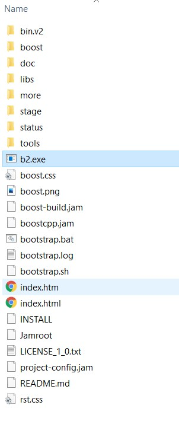

boost-playground
================
### Notes
- This project DOES NOT use Clang, just `mingw64` (x86_64-8.1.0-release-win32-seh-rt_v6-rev0.7z)

### Prerequisite
- ~~Latest version of Visual Studio (currently 2019)~~
- `mingw64` mentioned above
- Latest version of CMake (currently 3.18)

### How to set up Boost?
1. ~~[Download latest version](https://www.boost.org/users/download/#live)  (currently 1.73.0)~~
2. ~~Unzip to somewhere (`D:\Cpp Libraries` as in `CMakeLists.txt`, replace with your own path)~~
3. ~~Execute `bootstrap.bat`, then wait~~
4. ~~Execute `b2.exe` generated , then wait~~
5. Just unzip `boost-prebuilt/**/boost-*.*.*-*-*-*.tar.zip.*` somewhere as in `BOOST_ROOT` in `./CMakeLists.txt`
6. CMake this project by running `./local-build.cmd`

### The Boost root directory `BOOST_ROOT` should be like:

### Original source of prebuilt boost
- [Releases · MarkusJx/prebuilt-boost](https://github.com/MarkusJx/prebuilt-boost/releases/)
  - Huge thanks!

### References
- [c++ - How to build Boost 1.64 in 64 bits- - Stack Overflow](https://stackoverflow.com/questions/43946538/how-to-build-boost-1-64-in-64-bits/43950508)